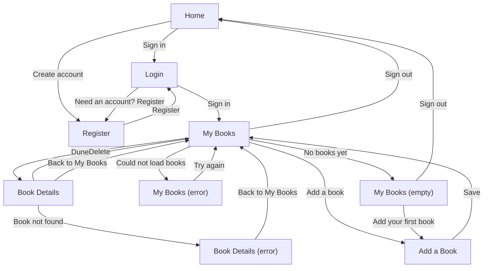
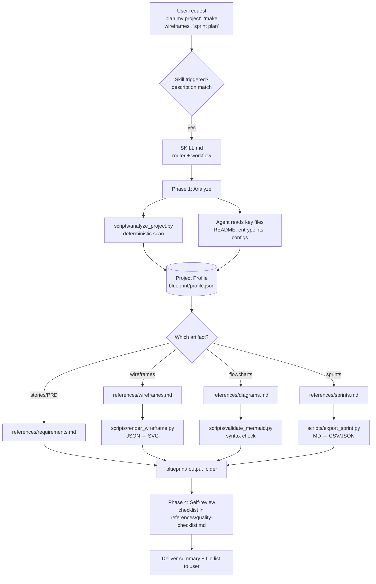

# project-blueprint

An Agent Skill that reads a software project (a codebase, a docs folder, or just an idea) and produces planning artifacts: a project profile, wireframes, diagrams, user stories, a PRD, ADRs, and sprint plans.

[](https://github.com/ItzMeet2/project_blueprint_skill/actions/workflows/validate.yml)
[](LICENSE)

> Status: version 0.1.0, not released yet. See the [changelog](CHANGELOG.md).

## Demo

Everything below was generated by following the skill on the small fake project in [examples/sample-dotnet-mvc](examples/sample-dotnet-mvc). The full output is in [examples/sample-output/blueprint](examples/sample-output/blueprint).

| Login | My Books |
|---|---|
|  |  |

The screen-flow diagram, built from the wireframe spec:



The sample output also contains 13 user stories and a 3-sprint plan.

## What it does

- **Understands a project:** scans the folder, detects the stack, routes, screens, and entities, and writes a structured `profile.json` that every other artifact is built from.
- **Wireframes:** low-fidelity grayscale SVGs plus an HTML gallery, rendered from a small JSON spec.
- **Diagrams:** flowcharts, sequence, ER, state, and architecture diagrams as Mermaid text, checked by a validator.
- **Requirements:** user stories with Given/When/Then criteria, a PRD, and ADRs.
- **Sprint plans:** epics, stories, estimates, dependencies, a Gantt chart, and CSV/JSON export for issue trackers.
- **Predictable output:** everything lands in a `blueprint/` folder in your project, and existing files are never overwritten.

## Install

The skill is the [project-blueprint](project-blueprint) folder (it contains `SKILL.md`). The steps below were checked against the official documentation on 2026-10-07; menu names and paths can change, so check the linked pages if something differs.

**Claude Code** ([docs](https://code.claude.com/docs/en/skills)): copy the folder to `~/.claude/skills/project-blueprint/` to use it in every project on your machine, or to `<your-repo>/.claude/skills/project-blueprint/` to use it in one repository (commit it to share it with your team). Claude then uses the skill automatically when your request matches its description, or you can invoke it by typing `/project-blueprint`.

**Claude.ai** ([help article](https://support.claude.com/en/articles/12512180-using-skills-in-claude)): zip the `project-blueprint` folder so that the folder itself is the top level inside the zip (its name must match the skill name). In Claude.ai open Customize, then Skills, choose Create skill, then Upload a skill, and select the zip. Code execution must be enabled. A packaged zip will be attached to the GitHub release once version 0.1.0 is published. Whether the Claude.ai environment can run the Python scripts is not verified here; if it cannot, the skill falls back to manual analysis and says so (see `SKILL.md`).

**Other agents:** point the agent at [project-blueprint/SKILL.md](project-blueprint/SKILL.md) as its instructions and let it read the `references/` files and run the `scripts/` when `SKILL.md` says to. This is generic guidance, not tested with any specific agent.

The scripts need Python 3.10 or newer and use only the standard library. `mmdc` ([mermaid-cli](https://github.com/mermaid-js/mermaid-cli)) is optional: if it is installed, diagrams are also parsed by it.

## Usage examples

Copy one of these into your agent:

1. `Here's my ASP.NET MVC project. Document it and make wireframes for the main screens.`
2. `Draw a flowchart and a sequence diagram of the sign-in flow in this repo.`
3. `Write user stories with acceptance criteria for this app, and a PRD I can show my team.`
4. `Break this project into a 3-sprint plan. I work alone. Include estimates and dependencies.`
5. `I have an idea for an app but no code yet. Help me figure out what to build first.`

## How it works



The agent does the reasoning; the scripts do the deterministic work (scanning, drawing, validating, exporting). See [docs/ARCHITECTURE.md](docs/ARCHITECTURE.md) and [docs/DESIGN_DECISIONS.md](docs/DESIGN_DECISIONS.md).

## Repo structure

```
project-blueprint/      The skill itself (what you install)
  SKILL.md              Router and workflow
  references/           Guides the agent reads on demand
  scripts/              analyze_project, render_wireframe, validate_mermaid, export_sprint
  assets/               Templates and JSON schemas
examples/               A fake sample project and the output the skill produced for it
evals/                  Test prompts and expectations (run by hand)
tests/                  pytest suite for the scripts, schemas, SKILL.md, and evals
docs/                   Architecture, design decisions, and the build spec
```

## Development

```
pip install -r requirements-dev.txt
pytest -q
python project-blueprint/scripts/validate_mermaid.py README.md docs project-blueprint examples
```

`pytest` and `jsonschema` are development dependencies only; the scripts themselves use the standard library. To try the skill itself, follow the steps in [evals/README.md](evals/README.md). The evals are run by hand and no results are published yet.

Known limits: the analyzer finds routes, screens, and entities with regular expressions, not real parsers, so it misses indirection such as mounted routers; the Mermaid validator without `mmdc` is heuristic. Both are described in the references so the agent can correct for them.

## Roadmap

Ideas, not built yet:

- Stack-specific analyzers (deeper .NET Core, Unity, Flutter).
- Export to Figma-importable formats, Excalidraw, and draw.io.
- Sync of sprint plans with GitHub Issues and Projects.
- An optional MCP server exposing the scripts as tools.
- Reuse of the wireframe spec and profile schema in a web app.

## Contributing

Contributions are welcome; see [CONTRIBUTING.md](CONTRIBUTING.md).

## License

[MIT](LICENSE)
