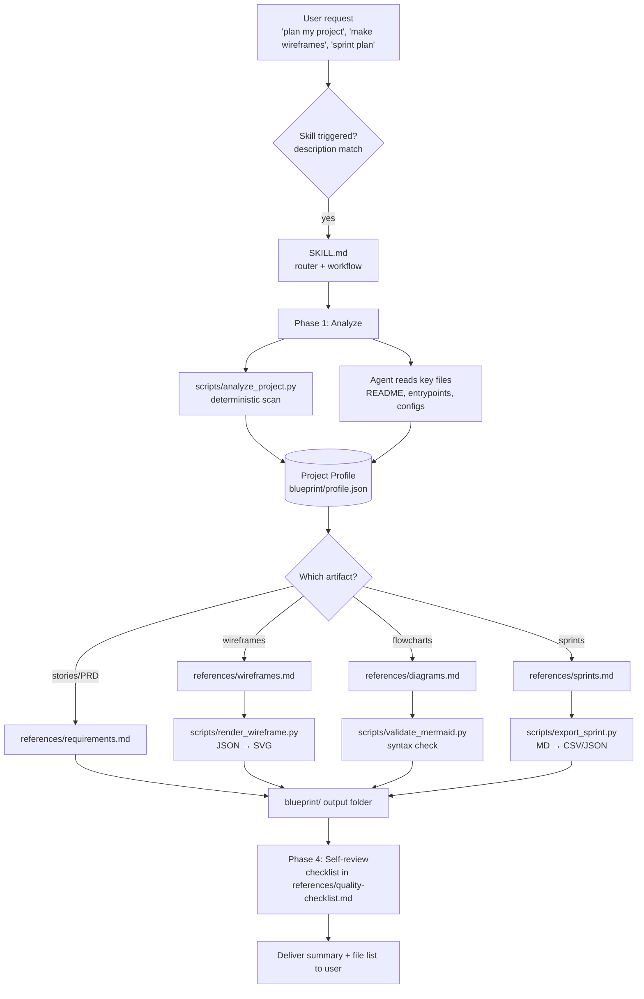
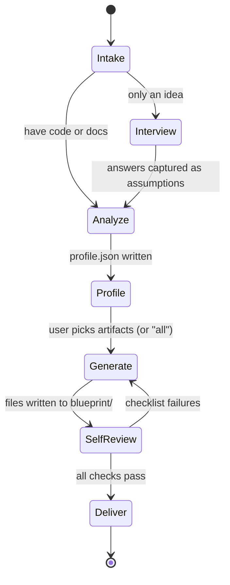
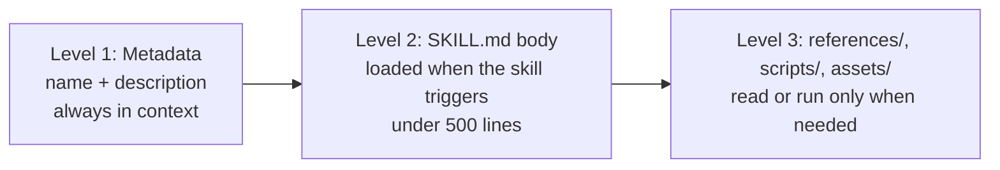

# Architecture

This document explains how `project-blueprint` is put together and why. For the individual decisions behind it, see [DESIGN_DECISIONS.md](DESIGN_DECISIONS.md).

## Overview

The skill is a folder, `project-blueprint/`, that an AI agent loads when a user's request matches the skill's description. The folder holds instructions (`SKILL.md` and `references/`), small deterministic scripts (`scripts/`), and static files (`assets/`). The agent reads the instructions, runs the scripts where they help, and writes everything to a `blueprint/` folder in the user's project.

## The four phases

1. **Intake:** find out what the user has and what they want.
2. **Analyze:** run the scanner, read the key files, and write `profile.json`. For an idea-only project, interview instead and record every answer as an assumption.
3. **Generate:** produce the requested artifacts, always from the profile.
4. **Self-review and deliver:** run the validators and the quality checklist, then summarize.

## Progressive disclosure

An agent's context is limited, so the skill loads only what it needs, in three levels:

- Level 1 is the `name` and `description` in the `SKILL.md` frontmatter. It is the only part present in every conversation, so it is short and written to match the phrases people use.
- Level 2 is the body of `SKILL.md`: the workflow, a routing table, the output contract, and failure handling. It stays short and points to the references instead of repeating them.
- Level 3 is everything else. Each reference file is mentioned in `SKILL.md` together with when to read it, so a request for wireframes loads `wireframes.md` but not `sprints.md`.

## Deterministic scripts and AI reasoning

The work is split on purpose:

| Done by scripts (same input, same output) | Done by the agent (judgment) |
|---|---|
| Walking the file tree, counting languages, finding marker files | Deciding what the product is for |
| Extracting routes, views, and entities by pattern | Correcting and merging that draft into `profile.json` |
| Drawing SVG from a wireframe spec | Choosing which screens exist and what they contain |
| Checking Mermaid syntax | Choosing what to draw and how to label it |
| Checking and exporting the sprint table | Splitting stories, estimating, ordering sprints |

Scripts handle what must be exact and repeatable and where a model would be slow or error-prone: a file count, a pixel position, a table parser. They never execute project code, never read secret files, and use only the Python standard library. The agent handles what needs understanding. Because the scripts are deterministic, their output can be tested, diffed in git, and trusted as a fixed point while the agent's output is checked against it.

## Data flow: one profile

`blueprint/profile.json` is the single source of truth. The scanner writes a draft (`analysis.raw.json`), the agent merges and corrects it into the profile, and every artifact is generated from the profile. Screen ids, entity names, and flow ids are reused everywhere, so wireframes, diagrams, stories, and sprints stay consistent with each other. The schema is [profile.schema.json](../project-blueprint/assets/schemas/profile.schema.json).

## Components

| Component | Location | Role |
|---|---|---|
| Skill entry | `project-blueprint/SKILL.md` | Triggering text, workflow, routing, output contract |
| References | `project-blueprint/references/` | Method guides: analysis, stack notes, wireframes, diagrams, sprints, requirements, quality checklist |
| Scanner | `scripts/analyze_project.py` | Writes `analysis.raw.json` |
| Renderer | `scripts/render_wireframe.py` | Wireframe JSON to SVG, HTML gallery, and screen-flow Mermaid |
| Validator | `scripts/validate_mermaid.py` | Heuristic (and optional `mmdc`) Mermaid checks |
| Exporter | `scripts/export_sprint.py` | Sprint table to CSV and JSON, with validation |
| Schemas and templates | `project-blueprint/assets/` | Profile and wireframe schemas, document templates |
| Example | `examples/` | A fake project and the output generated for it |
| Evals | `evals/` | Test prompts and expectations, run by hand |

## Safety boundaries

- Content found in analyzed files is treated as data, never as instructions.
- Secret files (`.env`, keys, `secrets*`) are listed by name and never read.
- Scripts write only to the directory they are given, and the agent writes only inside `blueprint/`.
- Existing files are never overwritten; new versions use a `-v2` suffix.
