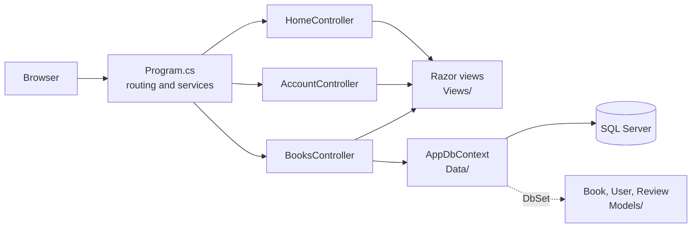

<!-- Generated by project-blueprint | 2026-10-07 | profile hash: c36373986139 -->

# Architecture: BookShelf

Component view of the ASP.NET Core MVC app, from `profile.json` (`structure.key_dirs`, `stack`, `entities`).

Notes:
- `AccountController` does not use `AppDbContext` yet: its login and register handlers do not read or write data (see the risks in `profile.json`).
- `Review` is mapped by the DbContext but no controller uses it.
