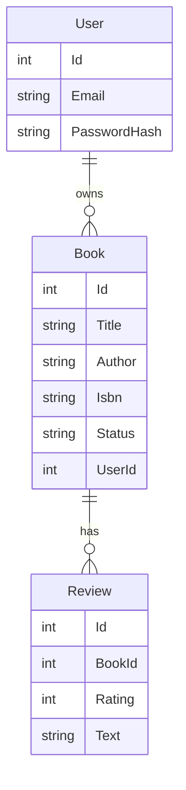

<!-- Generated by project-blueprint | 2026-10-07 | profile hash: c36373986139 -->

# Entity-relationship diagram: BookShelf

Entities and fields come from `profile.json`. The relationships are inferred from the `UserId` and `BookId` naming convention only (see `assumptions`).

