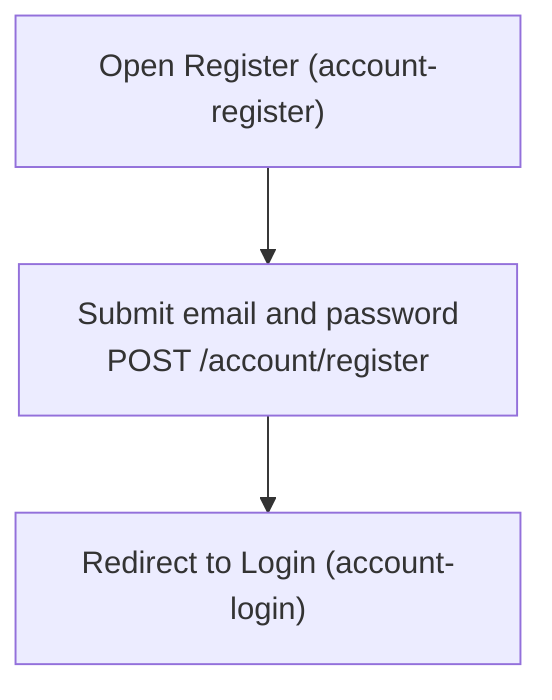
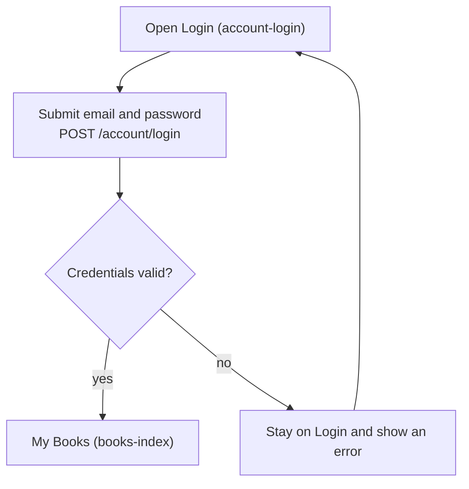
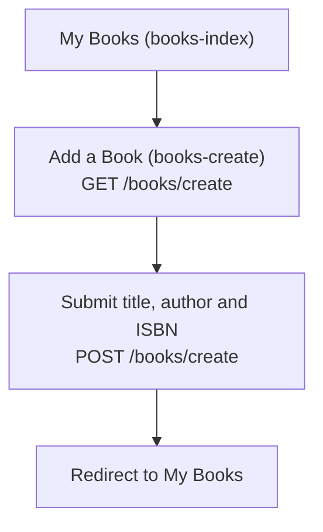
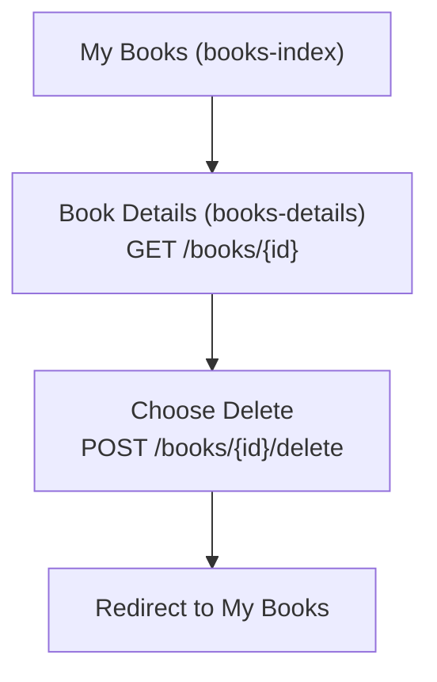

<!-- Generated by project-blueprint | 2026-10-07 | profile hash: c36373986139 -->

# Flows: BookShelf

One flowchart per flow in `profile.json`. All flows are inferred from controller redirects and views (see `assumptions`). Decision nodes marked with a comment are proposed behavior that the code does not implement yet.

## register

## sign-in

## add-book

## delete-book

