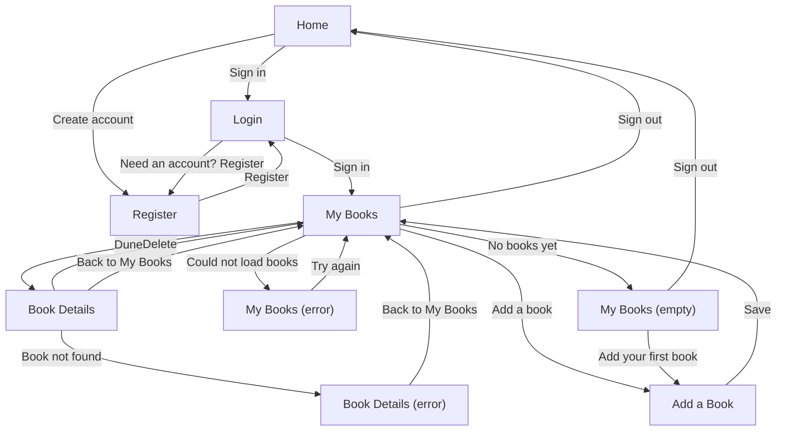

<!-- Generated by project-blueprint | 2026-10-07 | profile hash: c36373986139 -->

# Screen flow: BookShelf

```mermaid
flowchart TD
    home-index["Home"]
    account-login["Login"]
    account-register["Register"]
    books-index["My Books"]
    books-index__empty["My Books (empty)"]
    books-index__error["My Books (error)"]
    books-details["Book Details"]
    books-details__error["Book Details (error)"]
    books-create["Add a Book"]
    home-index -->|"Sign in"| account-login
    home-index -->|"Create account"| account-register
    account-login -->|"Sign in"| books-index
    account-login -->|"Need an account? Register"| account-register
    account-register -->|"Register"| account-login
    books-index -->|"Dune"| books-details
    books-index -->|"Add a book"| books-create
    books-index -->|"Sign out"| home-index
    books-index -->|"No books yet"| books-index__empty
    books-index -->|"Could not load books"| books-index__error
    books-index__empty -->|"Add your first book"| books-create
    books-index__empty -->|"Sign out"| home-index
    books-index__error -->|"Try again"| books-index
    books-details -->|"Delete"| books-index
    books-details -->|"Back to My Books"| books-index
    books-details -->|"Book not found"| books-details__error
    books-details__error -->|"Back to My Books"| books-index
    books-create -->|"Save"| books-index
```
