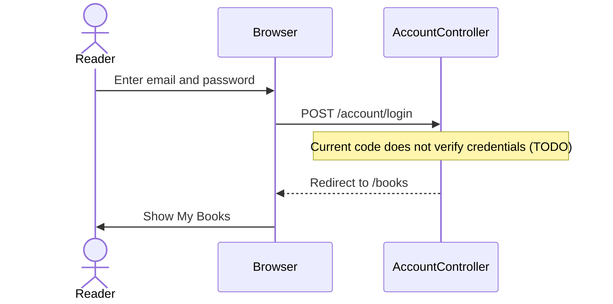
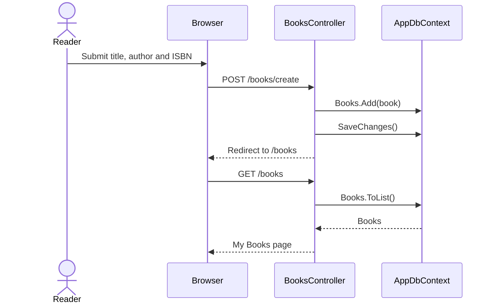

<!-- Generated by project-blueprint | 2026-10-07 | profile hash: c36373986139 -->

# Sequences: BookShelf

Key interactions, using routes and handlers from `profile.json`.

## Sign in

## Add a book

