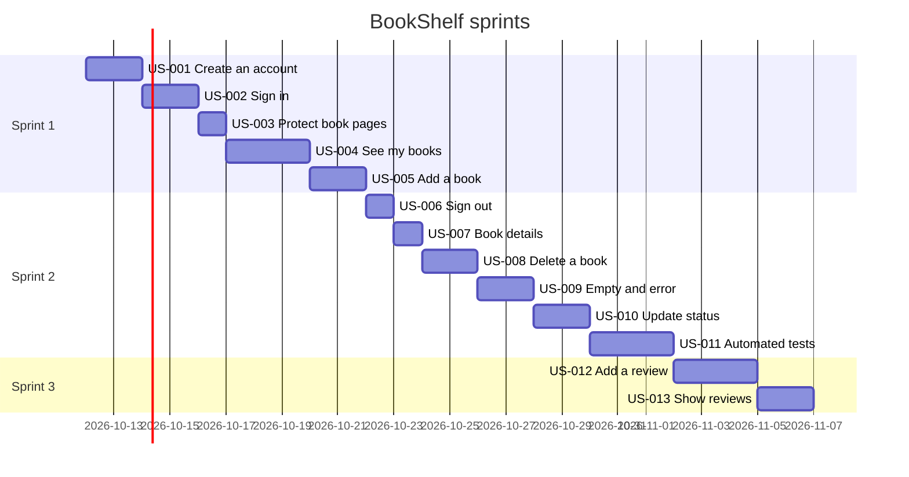
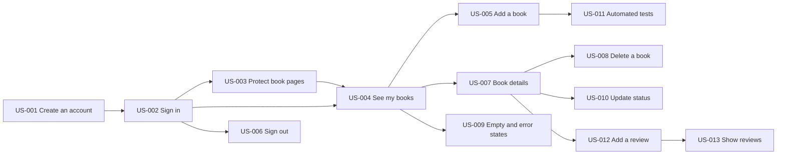

<!-- Generated by project-blueprint | 2026-10-07 | profile hash: c36373986139 -->

# Sprint Plan: BookShelf

Sprint length: 2 weeks

ASSUMPTION: one developer at about 20 points per sprint (the skill's default; no team size or velocity was given). Stories US-009, US-010, US-012 and US-013 describe behavior the code does not implement yet.

Sprint 1 is a thin vertical slice: create an account, sign in, see my books, and add a book, from the screens through the controllers to the database.

## Sprint 1

**Goal:** A reader can register, sign in, and see and add their own books end to end.

Capacity: 20
Planned: 18

### Stories

| ID | Epic | Story | Points | Priority | Depends On | Sprint | Acceptance Criteria |
|----|------|-------|--------|----------|------------|--------|---------------------|
| US-001 | Auth | As a visitor, I can create an account | 3 | Must | — | 1 | Given a new email and password, when I register, then my account exists and I land on Login |
| US-002 | Auth | As a reader, I can sign in | 3 | Must | US-001 | 1 | Given a wrong password, when I sign in, then I stay on Login with an error |
| US-003 | Auth | As a reader, my book pages are visible only when I am signed in | 2 | Must | US-002 | 1 | Given I am signed out, when I open /books, then I am sent to Login |
| US-004 | Books | As a reader, I can see my books | 5 | Must | US-002, US-003 | 1 | Given another reader owns a book, when I open My Books, then it is not listed |
| US-005 | Books | As a reader, I can add a book | 5 | Must | US-004 | 1 | Given a title, author and ISBN, when I save, then the book is listed on My Books |

### Risks
- Sign-in and registration are not implemented in the current code (TODO in the login handler), so US-001 and US-002 are new work, not wiring.
- Book queries are not scoped to a user yet; US-004 must add that, or readers would see each other's books.

### Definition of Done
- [ ] Code reviewed and merged
- [ ] Acceptance criteria verified by hand in the browser
- [ ] No credentials or connection strings committed
- [ ] Passwords stored only as hashes

### Demo checklist
- [ ] Register a new account, then sign in
- [ ] Add a book and see it on My Books
- [ ] Open /books while signed out and be sent to Login

## Sprint 2

**Goal:** Readers can manage their books fully, and the core flows are covered by tests.

Capacity: 20
Planned: 17

### Stories

| ID | Epic | Story | Points | Priority | Depends On | Sprint | Acceptance Criteria |
|----|------|-------|--------|----------|------------|--------|---------------------|
| US-006 | Auth | As a reader, I can sign out | 1 | Must | US-002 | 2 | Given I signed out, when I open /books, then I am sent to Login |
| US-007 | Books | As a reader, I can view a book's details | 2 | Must | US-004 | 2 | Given a book id that does not exist, when I open it, then I see Book not found |
| US-008 | Books | As a reader, I can delete a book | 3 | Should | US-007 | 2 | Given another reader's book, when I delete it, then nothing is deleted |
| US-009 | Books | As a reader, I see clear empty and error states | 3 | Should | US-004 | 2 | Given the books cannot load, when I open My Books, then I see an error and a Try again button |
| US-010 | Books | As a reader, I can change a book's reading status | 3 | Should | US-007 | 2 | Given a status that is not allowed, when I save, then it is not changed |
| US-011 | Quality | As a developer, I have automated tests for sign-in and the book flow | 5 | Should | US-005 | 2 | Given the test suite, when it runs, then it rejects a wrong password and another reader's book |

### Risks
- Allowed status values are an assumption (the code only shows the default To read); confirm them before US-010.
- US-011 depends on a login that really verifies credentials (US-002).

### Definition of Done
- [ ] Code reviewed and merged
- [ ] Acceptance criteria verified
- [ ] New behavior covered by an automated test once US-011 is done

### Demo checklist
- [ ] Open a book, change its status, and delete it
- [ ] Show the empty and error states
- [ ] Run the automated tests

## Sprint 3

**Goal:** Readers can review their books, and the plan has a buffer for what slipped.

Capacity: 20
Planned: 8

This sprint is deliberately light: it holds the Could items plus room for carry-over from earlier sprints.

### Stories

| ID | Epic | Story | Points | Priority | Depends On | Sprint | Acceptance Criteria |
|----|------|-------|--------|----------|------------|--------|---------------------|
| US-012 | Reviews | As a reader, I can rate and review a book | 5 | Could | US-007 | 3 | Given a rating outside 1 to 5, when I save, then no review is saved and I see an error |
| US-013 | Reviews | As a reader, I can see my reviews on a book | 3 | Could | US-012 | 3 | Given a book with no reviews, when I open it, then I see No reviews yet |

### Risks
- The review feature has no code yet: the Review entity exists, but there is no controller, route or view, so the estimates are less certain.

### Definition of Done
- [ ] Code reviewed and merged
- [ ] Acceptance criteria verified
- [ ] Reviews are tested for the invalid-rating case

### Demo checklist
- [ ] Add a review to a book and see it on the details page

## Timeline

Dates are placeholders (the sprint start date was not given).

## Dependency graph

An arrow points from a story to the stories that depend on it.

