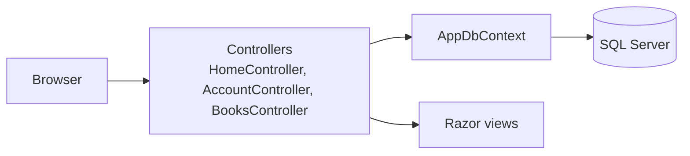
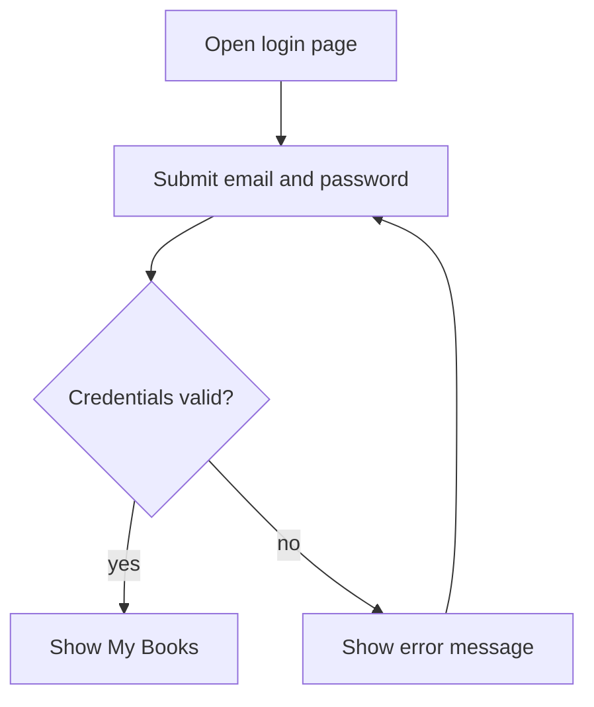
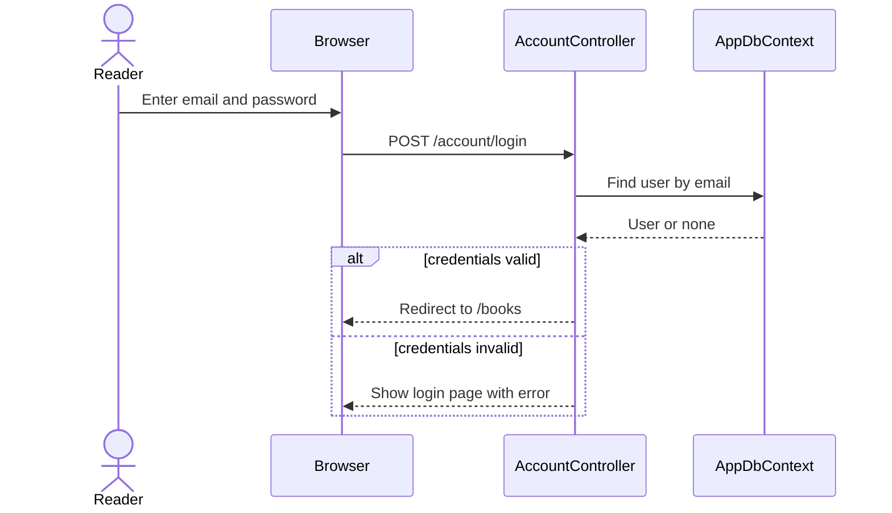
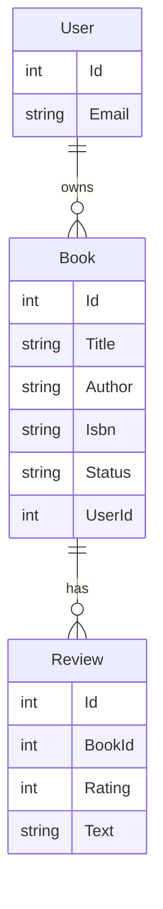
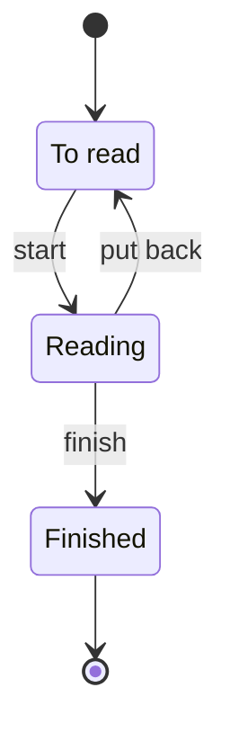
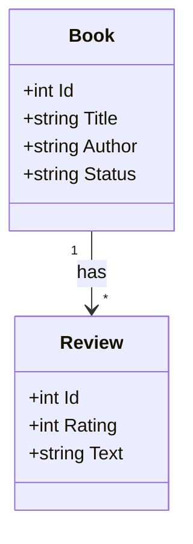
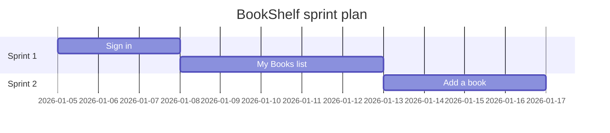

# Diagrams (Mermaid cookbook)

Read this file when the user wants flowcharts, architecture diagrams, sequence diagrams, ER diagrams, state diagrams, class diagrams, or a Gantt chart. All diagrams are Mermaid text inside fenced code blocks. Why Mermaid: it is plain text (diffable in git), and GitHub renders it directly in markdown files.

## Contents

1. Ground rules
2. Flowchart (architecture and user flows)
3. Sequence diagram
4. ER diagram
5. State diagram
6. Class diagram
7. Gantt chart
8. Validating

## 1. Ground rules

- **Node ids and names come from `profile.json`.** Use screen ids (`account-login`), entity names (`Book`), flow ids, and route handlers exactly as the profile spells them. Why: diagrams that rename things cannot be matched against the wireframes, stories, and code.
- **Draw only what the profile supports.** If a link or step is a guess, add an `ASSUMPTION:` to the profile and mark it in a `%% ASSUMPTION: ...` comment line in the diagram.
- **One diagram, one question.** Keep each under about 15 nodes; split larger ones (one flow per diagram in `flows.md`).
- **Ids are unique and plain**: letters, digits, hyphens, or underscores. Put human-readable text in the label, not the id.
- **Quote any label that contains punctuation** (`( ) [ ] { } < > : ; # "` or a leading digit): write `A["Sign in (email)"]`. Why: unquoted special characters are the most common cause of Mermaid parse errors.
- **Use `<br/>` for line breaks** inside labels, and `#quot;`, `#lt;`, `#gt;` when you need literal quote or angle-bracket characters.
- **Avoid reserved words as ids or labels**: `end` (use `End` or quote it), and for flowcharts also `graph`, `subgraph`, `style`, `class`, `click`, `default`.
- **Comments** start with `%%` on their own line.
- Put each diagram in its own fenced block starting with ` ```mermaid ` and with the type keyword on the first line.

## 2. Flowchart (architecture and user flows)

**When:** component or architecture overviews, user flows, process steps, and the screen-flow map. Use `flowchart TD` (top-down) for flows and `flowchart LR` (left-right) for layered architecture.

Architecture template (BookShelf):



User-flow template (decisions use `{ }`, outcomes use `[ ]`):



Pitfalls:
- A node defined twice with different labels is ambiguous. Define it once, then refer to it by id only.
- Edge labels go in pipes: `A -->|"label"| B`. Quote them if they contain punctuation.
- Shapes: `[text]` box, `(text)` rounded, `{text}` decision, `[(text)]` database, `((text))` circle. Brackets must be balanced on every line.
- Direction after the type must be one of `TB`, `TD`, `BT`, `RL`, `LR`.
- The screen-flow diagram is produced by `scripts/render_wireframe.py` (see `wireframes.md`); do not redraw it by hand.

## 3. Sequence diagram

**When:** one interaction across components over time: login, checkout, an API call chain.



Pitfalls:
- Declare participants first, in left-to-right order. Use `participant Short as Long name` for readable labels.
- `->>` is a solid request arrow and `-->>` a dashed reply.
- `alt ... else ... end`, `opt ... end`, and `loop ... end` blocks must each be closed with `end`.
- Take participant names and the message text (routes, handlers) from `profile.routes`, not from memory.

## 4. ER diagram

**When:** the data model: entities, fields, and relationships. Build it from `profile.entities`.



Pitfalls:
- Relationship syntax is `A <left>--<right> B : label`. Cardinality markers: `||` exactly one, `|o` zero or one, `}o` zero or many, `}|` one or many (mirror them on the other side, for example `||--o{`).
- The relationship label is required and is plain text; quote it if it has spaces and punctuation.
- Attributes are `type name` pairs, one per line. Use simple type words (`int`, `string`, `datetime`); replace spaces and generics (for example `List<Book>`) with a simple type.
- Do not put keys like `PK` unless the profile confirms them.
- Mark guessed relations: `%% ASSUMPTION: each book belongs to one user`.

## 5. State diagram

**When:** something with a lifecycle: a book's status, an order, a session.



Pitfalls:
- Use `stateDiagram-v2`. State ids have no spaces; give a readable name with `state "Long name" as id`.
- `[*]` marks the start and end.
- Transition labels follow a colon: `A --> B : label`.
- Composite states use `state Name { ... }` and must be closed with `}`.
- Only draw states and transitions the code supports (an enum, a status field, guarded actions). Otherwise label them as assumptions.

## 6. Class diagram

**When:** the code-level structure of models and their members, mainly for libraries and object-heavy code. For plain data, prefer the ER diagram.



Pitfalls:
- Members go inside braces, one per line, with `+` public, `-` private, `#` protected.
- Generic types use tildes, not angle brackets: `List~Book~`.
- Relationship arrows: `-->` association, `<|--` inheritance, `*--` composition, `o--` aggregation.
- Class names must match the code. Show only the members that matter to the user's question.

## 7. Gantt chart

**When:** a timeline of sprints or milestones. The sprint-specific rules (which tasks, which dates) are in `sprints.md`; this section covers only the syntax.



Pitfalls:
- Set `dateFormat` before the tasks. Each task line is `Name :id, start, duration`, where start is a date or `after <id>`, and the duration is like `3d` or `1w`.
- A task name must not contain a colon; the first colon separates the name from the settings.
- Task ids (`us001`) must be unique and use no spaces or hyphens.
- Start dates are placeholders unless the user gave real ones; say so in the surrounding text.

## 8. Validating

Run the validator on every file you wrote with diagrams, before delivering:

```
python scripts/validate_mermaid.py blueprint/
```

- It checks fenced `mermaid` blocks in `.md` files and `.mmd` files. Lines look like `path:line: ERROR message`; the exit code is 1 if any error was found. Fix every ERROR and rerun until it exits 0.
- WARNING lines (a node redefined with a different label, an unescaped `<` or `>`, a bare `end`) do not fail the run, but fix them unless you have a reason not to.
- If `mmdc` (mermaid-cli) is installed the script also runs it for real parsing. Otherwise it prints `INFO: mmdc not found, heuristic checks only`. The heuristic checks catch common mistakes but cannot prove a diagram renders, so say so to the user when `mmdc` was not available.
- If Python is not available, re-read each diagram against the pitfalls above and tell the user the diagrams were not machine-checked.
