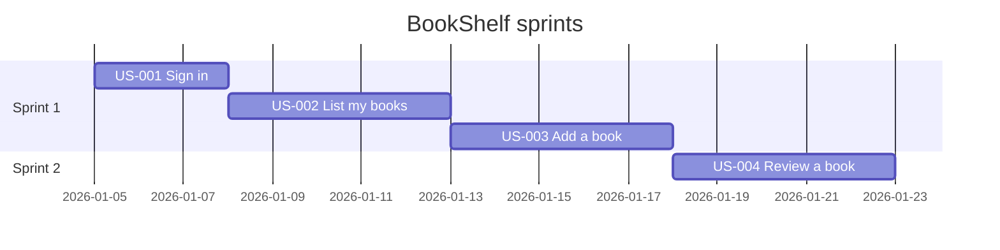
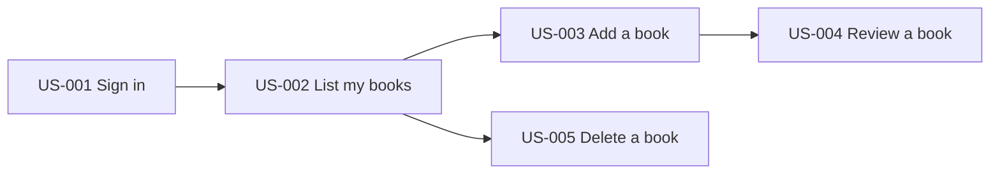

# Sprint planning

Read this file when the user wants a sprint plan, backlog, roadmap, task breakdown, estimates, or an MVP scope. Plans are built from `blueprint/profile.json` and the user stories (see `requirements.md`), written to `blueprint/sprints/sprint-plan.md`, and exported by `scripts/export_sprint.py`. Why a strict table: the script parses it into CSV and JSON for Jira, Trello, or GitHub Projects, so the format must not drift.

## Contents

1. Inputs
2. Method
3. Estimation scale
4. Ordering rules and the first sprint
5. Capacity
6. Required table format
7. Per-sprint content
8. Diagrams (Gantt and dependency graph)
9. Running the exporter and fixing errors

## 1. Inputs

- The profile (screens, routes, entities, flows), and the user stories if they exist. If they do not, write the stories first using `requirements.md`.
- Sprint length: default 2 weeks.
- Team size and velocity: default is one developer at about 20 points per sprint. This is the spec's default assumption, not a measured figure. **Ask only when the answer changes the plan**, for example when the user mentions a team. Why: a question the default can answer wastes the user's time. State the assumption in the plan: `ASSUMPTION: solo developer, 20 points per 2-week sprint`.
- Fixed constraints from the user (a deadline, a must-have feature) come first.

## 2. Method

1. **Convert the profile into work.** Group related flows, screens, and entities into **epics** (for example Auth, Books, Reviews). Split each epic into **user stories** (one user-visible capability each). Break stories into **tasks** only when it helps; list tasks as a checklist under the sprint, never inside the story table.
2. **Estimate** each story with the scale in section 3. Split any story above 8 points.
3. **Order** by the rules in section 4.
4. **Assign sprints** until each sprint's planned points fit its capacity.
5. **Write the plan** with the template `assets/templates/sprint-plan.md`, one `## Sprint N` section per sprint.
6. **Add the diagrams** (section 8), then run the exporter.

Use only work the profile supports. If you add a story for something the code does not show (tests, deployment, a missing screen), label it `ASSUMPTION:` in the story text.

## 3. Estimation scale

Points are relative effort, not hours. Allowed values: **1, 2, 3, 5, 8**.

| Points | Meaning |
|---|---|
| 1 | Trivial change to something that exists |
| 2 | Small, well understood, one place to change |
| 3 | Moderate; a screen with a simple form, or one endpoint with its data access |
| 5 | Substantial; touches several layers (UI, logic, data) |
| 8 | The largest allowed; has some unknowns. If you hesitate between 8 and 13, split it |

**A story above 8 must be split.** Split by user-visible steps (list, then add, then delete), not by technical layers, so each piece still delivers something. Why: the exporter rejects anything outside this scale, and big stories hide risk.

## 4. Ordering rules and the first sprint

Order stories by, in this priority:
1. **Dependencies first.** A story never sits in an earlier sprint than something it depends on.
2. **Risk reduction.** Put the riskiest or most uncertain work early, while it is cheap to change course.
3. **User value.** Among equals, deliver what users need most (Must before Should before Could).

**Sprint 1 must be a thin vertical slice:** a small end-to-end path that runs through every layer (UI, logic, data) and can be demonstrated. Example for BookShelf: sign in, see the book list, add one book. Why: it proves the architecture early and gives the first demo something real. Do not fill Sprint 1 with only setup or only back-end work.

Items marked Won't are out of scope: list them under an "Out of scope" heading as bullets, not in the story table.

## 5. Capacity

- Capacity is the number of points the team can finish in one sprint. Write it on its own line under each sprint heading, exactly as `Capacity: 20`.
- Planned points are the sum of the points of that sprint's stories. Keep planned at or below capacity.
- `export_sprint.py` warns when a sprint's planned points exceed its capacity by more than 10%. Treat the warning as a prompt to move a story, not as noise.
- Leave a little slack (planned a bit under capacity) for the first sprint, because estimates are least reliable there.

## 6. Required table format

`export_sprint.py` parses every table with exactly this header. **Do not rename, reorder, or add columns.**

```markdown
| ID | Epic | Story | Points | Priority | Depends On | Sprint | Acceptance Criteria |
|----|------|-------|--------|----------|------------|--------|---------------------|
| US-001 | Auth | As a user, I can sign in | 3 | Must | — | 1 | Given valid creds, when I submit, then I land on dashboard |
```

Cell rules:
- **ID:** unique, like `US-001`; the same id as in `user-stories.md`.
- **Points:** one of 1, 2, 3, 5, 8.
- **Priority:** `Must`, `Should`, `Could`, or `Won't`.
- **Depends On:** `—` (em dash) for none, otherwise story ids separated by commas, for example `US-001, US-002`. Each must exist.
- **Sprint:** a whole number, 1 or higher.
- **Acceptance Criteria:** one line. Write a literal pipe as `\|`. No line breaks inside a table row.
- Tables inside code fences are ignored, so format examples in a fence never collide with the real plan.

## 7. Per-sprint content

Each sprint section has: a one-sentence **goal**, its **stories** (the table, a separate table per sprint is fine), **capacity vs planned** points, **risks**, a **definition of done**, and a **demo checklist**. The template provides all of them. Tailor the definition of done and the demo steps to the product; do not leave the template's generic placeholders.

## 8. Diagrams

Include both. Validate them (see `diagrams.md`). Use story ids from the plan, and replace the sample dates with real ones or say they are placeholders.

Gantt (task ids have no hyphens, so `US-001` becomes `us001`):



Dependency graph (an arrow means "depends on", pointing from the prerequisite to the dependent story):



## 9. Running the exporter and fixing errors

```
python scripts/export_sprint.py blueprint/sprints/sprint-plan.md --csv blueprint/sprints/sprint-plan.csv --json blueprint/sprints/sprint-plan.json
```

On success it prints the story, point, and sprint counts. On any error it prints `path:line: ERROR message`, writes nothing, and exits 1. Fix and rerun until it passes.

| Message contains | Fix |
|---|---|
| `Points must be one of 1, 2, 3, 5, 8` | Change to a valid value. Above 8: split the story |
| `Priority must be one of` | Use `Must`, `Should`, `Could`, or `Won't` |
| `Sprint must be a whole number` | Use 1, 2, 3, and so on |
| `duplicate ID` | Give each story a unique id |
| `references unknown ID` | Correct the id in Depends On, or add the missing story |
| `dependency cycle: A -> B -> A` | Remove or reverse one dependency; two stories cannot each wait for the other |
| `expected 8 columns` | A row has too many or too few cells; escape any `\|` in text |
| `separator row ... is missing` | Add the `|----|...` line under the header |
| `no story table found` | The header does not match exactly; copy it from section 6 |

Warnings (exit code stays 0): a sprint is more than 10% over its capacity, or a story depends on a story in a later sprint. Fix both by moving stories; the plan should not contradict itself.

If Python is unavailable, check the table by hand against section 6, and tell the user the CSV and JSON could not be generated.
