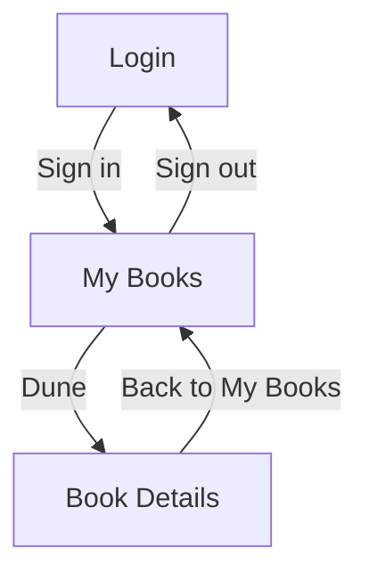

# Wireframes

Read this file when the user wants wireframes, mockups, screen layouts, or a screen-flow map. You write a small JSON spec; `scripts/render_wireframe.py` turns it into grayscale SVG files, an optional HTML gallery, and a screen-flow diagram. Why a spec and not hand-drawn SVG: the spec is short, diffable, and always renders the same, so you can fix a screen by editing one line and rerunning.

## Contents

1. Spec format
2. Element reference
3. Design rules
4. Deriving screens from the profile
5. State variants
6. Running the renderer
7. Worked example (BookShelf)

## 1. Spec format

```json
{
  "project": "Example App",
  "viewport_presets": {"mobile": [390, 844], "desktop": [1280, 800]},
  "screens": [
    {
      "id": "login",
      "name": "Login",
      "viewport": "mobile",
      "notes": "Shown to unauthenticated users",
      "elements": [{"type": "header", "text": "Welcome back"}],
      "navigates_to": [{"element": "Sign in", "screen": "dashboard"}]
    }
  ]
}
```

| Field | Required | Meaning |
|---|---|---|
| `project` | yes | Project name, taken from `profile.project.name` |
| `viewport_presets` | no | Extra named sizes as `[width, height]`. `mobile` (390x844) and `desktop` (1280x800) always exist |
| `screens[].id` | yes | Lowercase-kebab id; must equal the profile screen id (see section 4) |
| `screens[].name` | yes | Human-readable title shown in the gallery and flow diagram |
| `screens[].viewport` | no | A preset name; default `mobile` |
| `screens[].notes` | no | One line of context, shown in the HTML gallery |
| `screens[].elements` | yes | Elements stacked top to bottom |
| `screens[].navigates_to` | no | Links to other screens: `element` is the text of the control that is used, `screen` is the target screen id |

The renderer validates the spec and reports the JSON path of every problem (for example `screens[1].elements[2]: input requires 'label'`). Fix the named path and rerun. The formal schema is `assets/schemas/wireframe.schema.json`, and a complete example is `assets/templates/wireframe-spec.example.json`.

## 2. Element reference

Every element needs `"type"`. "Required" fields must be non-empty.

| Type | Required | Optional | Example |
|---|---|---|---|
| `header` | `text` | `level` (1, 2, 3) | `{"type": "header", "text": "My Books"}` |
| `text` | `text` | | `{"type": "text", "text": "Track what you read."}` |
| `image` | | `alt`, `caption` | `{"type": "image", "alt": "Book cover"}` |
| `input` | `label` | `placeholder`, `secret` (shows dots) | `{"type": "input", "label": "Email", "placeholder": "you@mail.com"}` |
| `textarea` | `label` | `placeholder` | `{"type": "textarea", "label": "Review"}` |
| `select` | `label` | `options` (first is shown) | `{"type": "select", "label": "Status", "options": ["To read", "Reading"]}` |
| `checkbox` | `label` | `checked` | `{"type": "checkbox", "label": "Remember me", "checked": true}` |
| `radio` | `label` | `options` (one radio per option) | `{"type": "radio", "label": "Format", "options": ["Print", "Ebook"]}` |
| `toggle` | `label` | `on` | `{"type": "toggle", "label": "Email reminders", "on": true}` |
| `button` | `text` | `primary` (solid style) | `{"type": "button", "text": "Save", "primary": true}` |
| `link` | `text` | | `{"type": "link", "text": "Forgot password?"}` |
| `list` | `items` (non-empty list of strings) | | `{"type": "list", "items": ["Dune", "Emma"]}` |
| `card` | `title` | `text` | `{"type": "card", "title": "Dune", "text": "Frank Herbert"}` |
| `table` | `columns` (non-empty) | `rows` (list of lists) | `{"type": "table", "columns": ["Title", "Author"], "rows": [["Dune", "Herbert"]]}` |
| `tabs` | `items` | `active` (index, default 0) | `{"type": "tabs", "items": ["All", "Reading"], "active": 0}` |
| `nav` | `items` | `active` (index) | `{"type": "nav", "items": ["Home", "Books", "Account"], "active": 1}` |
| `modal` | `title` | `text`, `actions` (the last one is the primary button) | `{"type": "modal", "title": "Delete book?", "actions": ["Cancel", "Delete"]}` |
| `divider` | | | `{"type": "divider"}` |
| `spacer` | | `height` (positive integer, default 16) | `{"type": "spacer", "height": 24}` |
| `row` | `children` | | `{"type": "row", "children": [{"type": "button", "text": "Edit"}, {"type": "button", "text": "Delete"}]}` |
| `column` | `children` | | `{"type": "column", "children": [{"type": "text", "text": "Line 1"}]}` |

`row` places its children side by side with equal widths; `column` stacks them. They may nest up to 3 levels; a fourth level is a validation error. Why: deeper nesting produces unreadable low-fidelity layouts, and it usually means the screen should be split.

## 3. Design rules

- **One primary action per screen.** Mark exactly one button `"primary": true`. Why: wireframes exist to settle what the user is meant to do next. Exception: in a confirmation dialog for a destructive action (for example "Delete book?"), do not make the destructive button the primary one. Mark the safe choice (Cancel) as secondary and leave the destructive button clearly labeled, or mark neither as primary.
- **Every screen is reachable** from at least one other screen through `navigates_to`. The renderer warns on stderr about any screen other than the first that has no incoming link. A warning means either a missing link or a screen that should not exist.
- **Use real content from the profile**, never filler text: real field names from `entities`, real button names from `routes`, real screen names. Why: placeholder text hides whether the screen actually fits the product.
- **Add empty and error variants** for any screen that loads data, and a loading variant only when the stack has a client-side loading state (section 5).
- **Mobile-first** unless the project type says otherwise (`desktop` for desktop apps and admin tools; for web apps design `mobile` first and add `desktop` only if asked).
- **Do not invent screens or fields.** If a screen is a proposal and not in the code, say so in `notes` and add an `ASSUMPTION:` to the profile. State variants (section 5) are the allowed kind of proposal: they may be added when they are labeled as proposals.
- Keep labels short: long text is shortened with an ellipsis in the drawing.

## 4. Deriving screens from the profile

1. Open `blueprint/profile.json` and take every item in `screens`.
2. Create one wireframe screen per item: `id` equals the profile `id`, `name` equals the profile `name`, and `notes` can carry `purpose`. Why: shared ids are what let flows, stories, and sprints refer to the same screen.
3. Fill `elements` from what the screen does: forms from `entities` fields (an input per editable field), buttons from `routes` (a POST route on the screen suggests a submit button), lists or tables for collection routes.
4. Fill `navigates_to` from links, redirects, and form submits. Use the real control text as `element`.
5. If the profile has no `screens` (idea-only input), propose screens from the main flows and label them as assumptions.

## 5. State variants

For a screen `books-index` that loads data, add separate screens named with a double hyphen:

- `books-index--empty`: what the user sees with no data, plus the action that fixes it
- `books-index--loading`: skeleton or short loading text
- `books-index--error`: what failed and a retry button

Rules: the variant `id` is the base id plus `--empty`, `--loading`, or `--error`; use the same `viewport`; link each variant from the base screen with a `navigates_to` entry whose `element` describes the condition (for example `"No books yet"`). Why: the double hyphen is accepted by the renderer and the schema for exactly this purpose, and the link keeps the screen-flow diagram connected.

Variants are proposals, so label each one in `notes` (for example "Proposed state; the current code has no error handling") and keep it consistent with the "do not invent screens" rule. Add `--loading` only when the stack has a client-side loading state, such as a single-page app that fetches data after the page opens. Server-rendered multi-page apps (for example ASP.NET MVC with Razor views) have no loading state, so give them `--empty` and `--error` only.

## 6. Running the renderer

```
python scripts/render_wireframe.py blueprint/wireframes/spec.json --out blueprint/wireframes/ --html
```

- Writes one `<screen-id>.svg` per screen, an `index.html` gallery (with `--html`), and `screen-flow.md` next to them.
- `--theme dark` switches the SVG files to the dark theme. The gallery always contains both themes.
- Output is deterministic: identical spec, identical bytes.
- **Move `screen-flow.md` to `blueprint/diagrams/screen-flow.md`** so it follows the output contract in `SKILL.md`, and put the standard generated-by header (defined in the output contract) on its first line, because the renderer does not write one. If the target file already exists, do not overwrite it; write the new one with a `-v2` suffix.
- Validate the flow diagram with `scripts/validate_mermaid.py` (see `diagrams.md`).
- Exit code is non-zero if the spec is invalid; nothing is written in that case.
- Save the spec as `blueprint/wireframes/spec.json` so the user can rerender after editing.

## 7. Worked example (BookShelf)

Starting point: the sample profile has screens `account-login`, `books-index`, and `books-details`, with routes `POST /account/login`, `GET /books`, and `GET /books/{id}`, and a `Book` entity with `Title`, `Author`, `Isbn`, and `Status`.

```json
{
  "project": "BookShelf",
  "screens": [
    {
      "id": "account-login",
      "name": "Login",
      "viewport": "mobile",
      "notes": "Sign in with email and password",
      "elements": [
        {"type": "header", "text": "Sign in to BookShelf"},
        {"type": "input", "label": "Email", "placeholder": "you@mail.com"},
        {"type": "input", "label": "Password", "secret": true},
        {"type": "button", "text": "Sign in", "primary": true},
        {"type": "link", "text": "Need an account? Register"}
      ],
      "navigates_to": [{"element": "Sign in", "screen": "books-index"}]
    },
    {
      "id": "books-index",
      "name": "My Books",
      "viewport": "mobile",
      "notes": "Lists the signed-in reader's books",
      "elements": [
        {"type": "header", "text": "My Books"},
        {"type": "tabs", "items": ["All", "To read", "Reading", "Finished"], "active": 0},
        {"type": "table", "columns": ["Title", "Author", "Status"],
         "rows": [["Dune", "Frank Herbert", "Reading"], ["Emma", "Jane Austen", "To read"]]},
        {"type": "button", "text": "Add a book", "primary": true},
        {"type": "link", "text": "Sign out"}
      ],
      "navigates_to": [
        {"element": "Dune", "screen": "books-details"},
        {"element": "Sign out", "screen": "account-login"}
      ]
    },
    {
      "id": "books-details",
      "name": "Book Details",
      "viewport": "mobile",
      "notes": "Shows one book with delete action",
      "elements": [
        {"type": "header", "text": "Dune"},
        {"type": "text", "text": "by Frank Herbert (ISBN 9780441013593)"},
        {"type": "select", "label": "Status", "options": ["Reading", "To read", "Finished"]},
        {"type": "row", "children": [
          {"type": "button", "text": "Save status", "primary": true},
          {"type": "button", "text": "Delete"}
        ]},
        {"type": "link", "text": "Back to My Books"}
      ],
      "navigates_to": [{"element": "Back to My Books", "screen": "books-index"}]
    }
  ]
}
```

The screen-flow diagram that `render_wireframe.py` writes for this spec (shown here so you know what to expect):



Notes on the choices: the "Add a book" button has no `navigates_to` entry because the `books-create` screen is not part of this example; in a real run, add that screen and link it. The book titles in the table are sample content for the layout, not data from the code, so say so in `notes` if the user might mistake them for real records.
