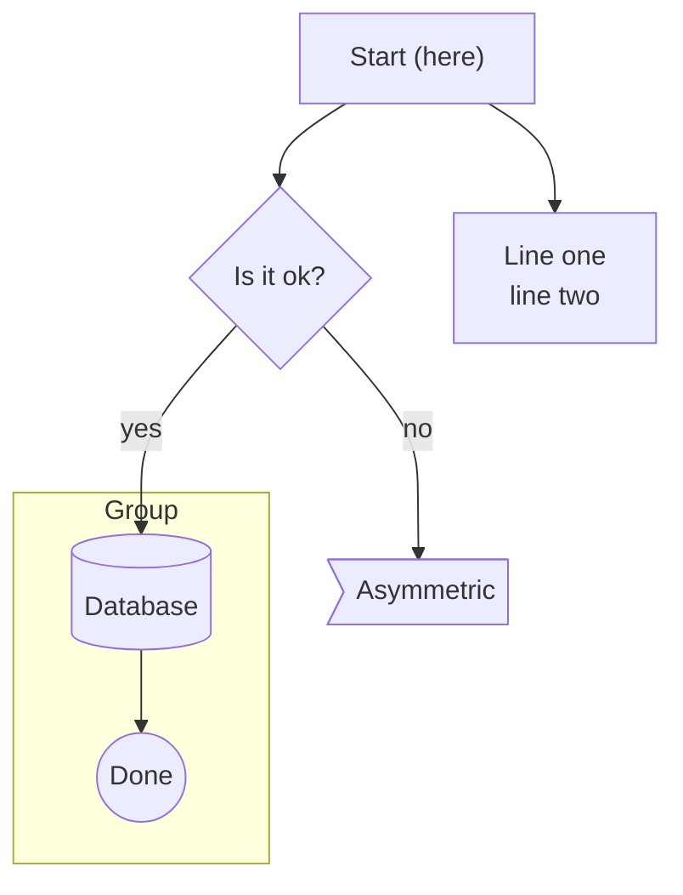
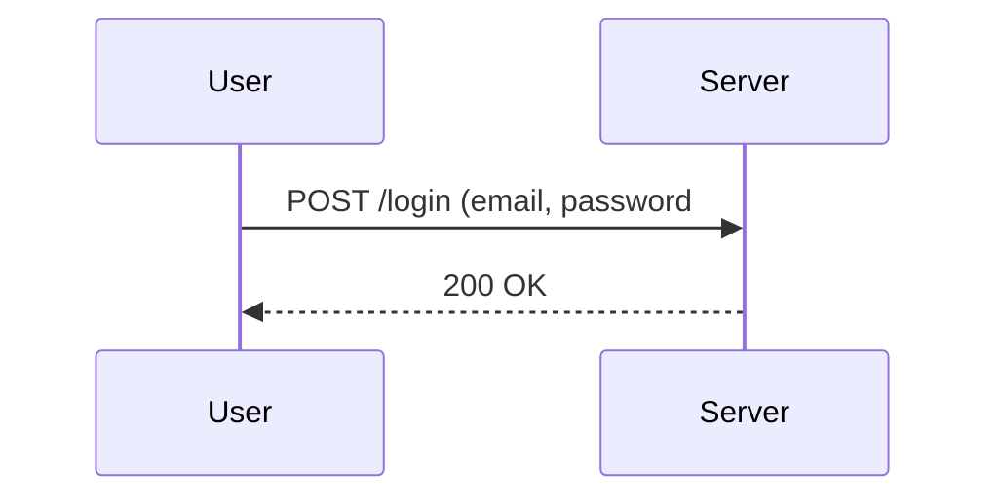
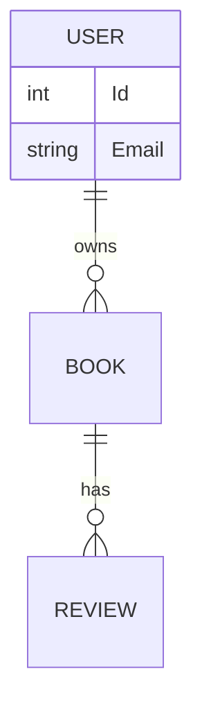
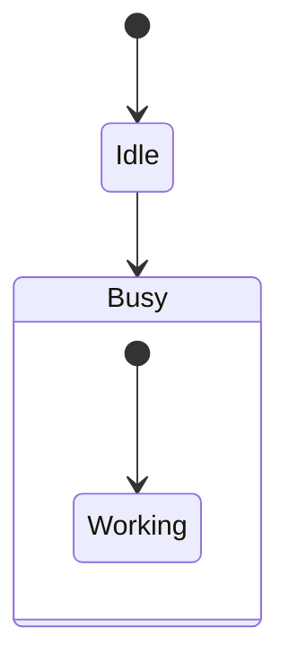

# Valid diagrams

```mermaid
flowchart TD
    A["Start (here)"] --> B{Is it ok?}
    B -- yes --> C[(Database)]
    B -->|"no"| D>Asymmetric]
    subgraph one [Group]
        C --> E((Done))
    end
    A --> F[Line one<br/>line two]
```

```mermaid
sequenceDiagram
    participant U as User
    participant S as Server
    U->>S: POST /login (email, password
    S-->>U: 200 OK
```

```mermaid
erDiagram
    USER ||--o{ BOOK : owns
    BOOK ||--o{ REVIEW : has
    USER {
        int Id
        string Email
    }
```

```mermaid
stateDiagram-v2
    [*] --> Idle
    Idle --> Busy
    state Busy {
        [*] --> Working
    }
```
